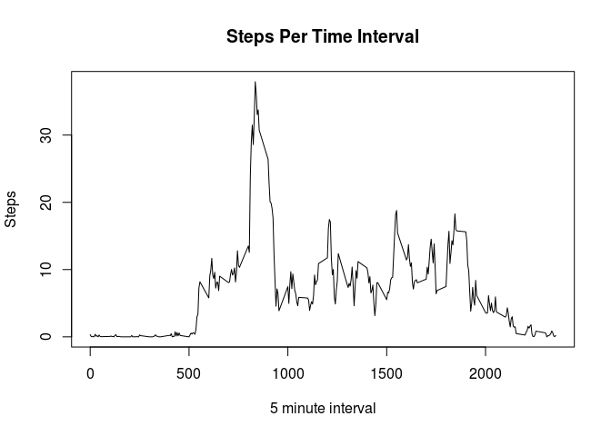

# Reproducible Research: Peer Assessment 1

## Loading and preprocessing the data


```r
#load data and ggplot library
data<-read.csv("activity.csv")
library(ggplot2)
```

## What is mean total number of steps taken per day?

```r
#build new table, tracking average number of steps per day
stepsPerDay=data.frame(date=character(0),steps=numeric(0),stringsAsFactors=F)

#repeat for each day
for(i in levels(data$date)){
  thisDate<-sum(data$steps[data$date==i],na.rm=T)/length(levels(data$date))
  stepsPerDay[nrow(stepsPerDay)+1,]=c(i,(thisDate))
  }


stepsPerDay$steps<-as.numeric(stepsPerDay$steps)

#plot histogram and report mean and median
hist(stepsPerDay$steps,main="Steps Per Day",xlab="Steps per day")
```

 

```r
meanSteps<-mean(stepsPerDay$steps)
medianSteps<-median(stepsPerDay$steps)

print(paste("The mean number of steps per day is ",toString(meanSteps)," and the median is ",toString(medianSteps),".",sep=""))
```

```
## [1] "The mean number of steps per day is 153.348024724536 and the median is 170.409836065574."
```


## What is the average daily activity pattern?

```r
#build table for avg steps per 5 min interval
#also, track interval with highest steps
stepsPerInterval=data.frame(interval=character(0),steps=numeric(0),stringsAsFactors=F)
mostSteps<-0
highestInterval<-0

#repeat for each interval
for(i in levels(as.factor(data$interval))){
  thisInterval<-sum(data$steps[data$interval==i],na.rm=T)/length(levels(as.factor(data$interval)))
  stepsPerInterval[nrow(stepsPerInterval)+1,]=c(i,(thisInterval))
  if(thisInterval>mostSteps){
    mostSteps<-thisInterval
    highestInterval=i

    }
  }


stepsPerInterval$steps<-as.numeric(stepsPerInterval$steps)
stepsPerInterval$interval<-as.numeric(stepsPerInterval$interval)

#plot and report top interval
plot(stepsPerInterval$interval,stepsPerInterval$steps,type="l",main="Steps Per Time Interval",xlab="5 minute Interval",ylab="Steps")
```

 

```r
print(paste("The time interval with the most steps is ",toString(highestInterval),".",sep=""))
```

```
## [1] "The time interval with the most steps is 835."
```


## Imputing missing values

```r
#build new data table to fix  missing values
#for each time interval missing data, we will add the average value for the interval in the rest of the data
data2<-data
subValue=0

#repeat for each row of table
for(i in 1:nrow(data2)){
  if (is.na(data2$steps[i])){
    #find  value to put in this interval
    for (j in 1:nrow(stepsPerInterval)){
        if (stepsPerInterval$interval[j]==data2$interval[i]){
          data2$steps[i]<-stepsPerInterval$steps[j]
        }
    }
  }
}

#create new steps per day table as in step 1
stepsPerDay2=data.frame(date=character(0),steps=numeric(0),stringsAsFactors=F)

for(i in levels(data2$date)){
  thisDate<-sum(data2$steps[data2$date==i])/length(levels(data2$date))
  stepsPerDay2[nrow(stepsPerDay2)+1,]=c(i,(thisDate))
  }


stepsPerDay2$steps<-as.numeric(stepsPerDay$steps)

hist(stepsPerDay2$steps,main="Steps Per Day",xlab="Steps per day")
```

 

```r
meanSteps2<-mean(stepsPerDay2$steps)
medianSteps2<-median(stepsPerDay2$steps)

print(paste("The mean number of steps per day is ",toString(meanSteps2)," and the median is ",toString(medianSteps2),".",sep=""))
```

```
## [1] "The mean number of steps per day is 153.348024724536 and the median is 170.409836065574."
```
These values are not different from part 1, because I used the mean for each time interval. Because entire days of data are missing, when I add in  the average for time intervals, the average steps/day stays the same.


## Are there differences in activity patterns between weekdays and weekends?


```r
#add type column, 2 possibility for type- weekday and weekend
for(i in 1:nrow(data2)){
  if (weekdays(as.POSIXct(data2$date[i]))=="Sunday" | weekdays(as.POSIXct(data2$date[i]))=="Saturday" ){
    data2$type[i]="weekend"

  }else data2$type[i]="weekday"
}

#create average steps per interval by type
stepsPerInterval2=data.frame(interval=character(0),steps=numeric(0),type=character(0),stringsAsFactors=F)

for(j in levels(as.factor(data2$type))){
for(i in levels(as.factor(data2$interval))){
  thisInterval<-sum(data2$steps[data$interval==i & data2$type==j])/length(levels(as.factor(data2$interval)))
  
  stepsPerInterval2[nrow(stepsPerInterval2)+1,]=c(i,thisInterval,j)
  }}


stepsPerInterval2$steps<-as.numeric(stepsPerInterval2$steps)
stepsPerInterval2$interval<-as.numeric(stepsPerInterval2$interval)


#plot two charts, line plot steps vs interval. weekend and weekday
g<-ggplot(stepsPerInterval2,aes(x=interval,y=steps))
print(g
      + geom_line()
      +facet_grid(type~.)
      +labs(x="Interval",
            y="Average Steps"))
```

 
